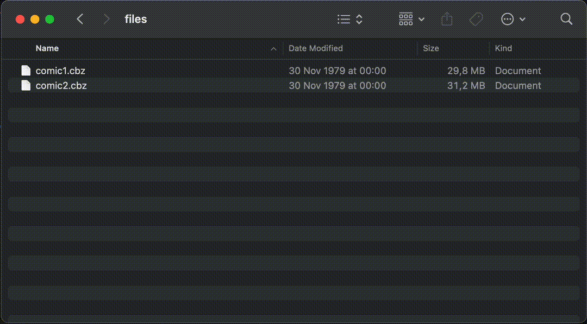

# CBZ to PDF

Simple and quick way to convert CBZ files to PDF files without losing quality.

## Demo

Simply drag and drop the executable into the <ins>same folder with your cbz files</ins>. Double click on the executable and PDF files will be created in the same folder (one `.pdf` for each `.cbz` file)



## Downloading

### Download executable (Recommended)

Download a [binary for your platform](https://github.com/Serious-Fin/cbz-to-pdf/releases) from release page.

On linux/mac you might need to add execution permission to file. Open terminal, go to the same directory as your downloaded file. Run:

```zsh
chmod +x <binary name>
```

### Build from source

#### Requirements

- Go version 1.13 or later. [Download latest go version here](https://go.dev/doc/install)

#### Steps

Open a console window and clone repository locally:

```zsh
git clone https://github.com/Serious-Fin/cbz-to-pdf.git
```

Move into the cloned repository

```zsh
cd cbz-to-pdf
```

Install all go dependencies

```zsh
go install
```

Build the project

```zsh
go build
```

Now you should have an executable `cbz-to-pdf`. Run it with double-click or via terminal:

```zsh
./cbz-to-pdf
```
